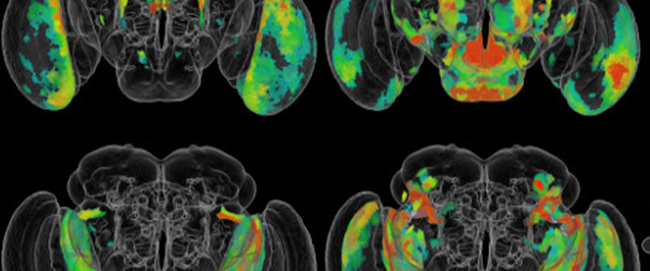
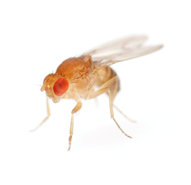

# Segmentation des Images de la Microscopie Électronique
#### Ludivine, Luigi, Jérémy

## Contexte du projet
L’IA est aujourd’hui omniprésente dans la littérature scientifique de l’imagerie médicale, d’autant plus depuis le développement de nouveaux algorithmes appelés réseaux de neurones convolutifs.
En effet, à ce jour, l’IA est très utile dans le domaine de l’imagerie, sur deux volets : la classification des images et la segmentation des organes. Les algorithmes pour classifier les images peuvent permettre d’aider au diagnostic en classant une image dans une catégorie particulière de pathologie. Les algorithmes pour segmenter les images sont couramment utilisés sur tous les types d’imagerie et en routine au CHRU. C’est ainsi que l’IA permet un gain de temps aux praticiens à la fois pour le diagnostic ou lors d’interventions. Elle présente aussi l’avantage de contourner certains biais liés à l’interprétation de l’opérateur.

## Modalités d'évaluation

* Description des données
* Présentation de l'architecture utilisée
* Conclusion (avantages et inconvénients, concurrents, recommandations…)

## Introduction 
Pour ce projet sur la segmentation, nous nous proposons d’étudier et traiter les images résultant de la publication d’A.Cardona et al. (2010) sur le système nerveux central de larves de Drosophilia melanogaster, modèle biologique couramment utilisé dans le domaine de la génétique et de la biologie du développement. L’article présente ici les avancées dans l’étude des microstructures neurophiles (qui qualifie tout élément qui se fixe essentiellement sur le système nerveux) afin d’établir une comparaison entre vertébrés et insectes.

  

[Presentation](Ressources/image2.png)

## Preprocessing
Le projet a été réalisé sur Google Colab, le dataset a été importé et dézippé à cet effet. Les paths ont été définis afin de poursuivre notre traitement et lancer le modèle.
Nous disposons des images de l’article (train et test) et de leur mask  (labels) en format TIFF qui nous permettront de segmenter les éléments souhaités (ici les cellules neuronales / synapses). Pour traiter les différentes images prévues pour l’apprentissage du modèle et d’évaluation, une fonction de conversion Tiff – PNG est réalisée.

